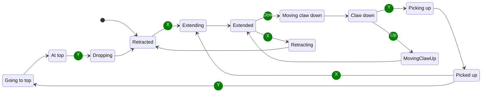
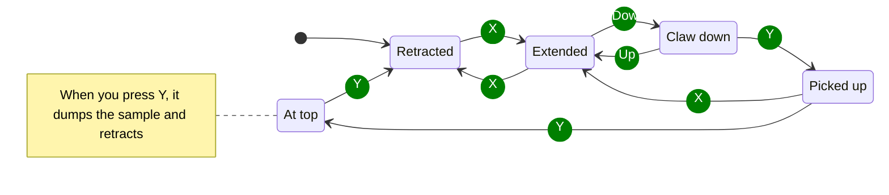

# Information

## Driver Flow

1. Driver drives over to the submersible
2. Driver presses `X` to extend the intake
3. Driver presses left and right on the D-Pad to change the intake extension length
4. Driver presses `down` on the D-Pad to lower the claw
5. Driver presses `Y` to grab the sample, and retract the intake into the robot
6. Driver drives over to the basket
7. Driver presses `Y` to extend the outtake to the basket
8. Driver presses `Y` to release the sample, and retract claw

## Robot Claw States

## Robot States Without Transitions

## Controls

### Gamepad 1

|     Button     | Action                                                             |
|:--------------:|:-------------------------------------------------------------------|
|     Start      | Reset heading for field centric                                    |
|       A        | Switch between tank and field centric                              |
|       X        | Extend or retract intake slide, or cancel pick up from submersible |
|       Y        | Pick up sample, extend outtake slide, or drop sample.              |
| Left Joystick  | Move robot                                                         |
| Right Joystick | Rotate robot                                                       |
|  Left Trigger  | Speed up                                                           |
| Right Trigger  | Slow down                                                          |
|    D-Pad Up    | Intake claw up                                                     |
|   D-Pad Down   | Intake claw down                                                   |
|   D-Pad Left   | Retract intake or outtake                                          |
|  D-Pad Right   | Extend intake or outtake                                           |

### Gamepad 2

No controls

## Wiring

### Motors

| Name                    | Location      | Port |
|-------------------------|---------------|------|
| leftFront               | Control Hub   |      |
| leftBack                | Control Hub   |      |
| rightFront              | Control Hub   |      |
| rightBack               | Control Hub   |      |
| leftTorqueOuttakeSlide  | Expansion Hub |      |
| leftSpeedOuttakeSlide   | Expansion Hub |      |
| rightTorqueOuttakeSlide | Expansion Hub |      |
| RightSpeedOuttakeSlide  | Expansion Hub |      |

### Servos

| Name                     | Location      | Port |
|--------------------------|---------------|------|
| leftIntakeSlide          | Expansion Hub |      |
| rightIntakeSlide         | Control Hub   |      |
| leftIntakeClawRotator    | Expansion Hub |      |
| rightIntakeClawRotator   | Control Hub   |      |
| intakeClawGrabber        | Control Hub   |      |
| intakeClawGrabberRotator | Control Hub   |      |
| leftOuttakeClawRotator   | Expansion Hub |      |
| rightOuttakeClawRotator  | Control Hub   |      |
| outtakeClawGrabber       | Control Hub   |      |

### Sensors

| Name                    | Location      | Port |
|-------------------------|---------------|------|
| leftIntakeSlideEncoder  | Expansion Hub |      |
| rightIntakeSlideEncoder | Control Hub   |      |

## Class Diagram

