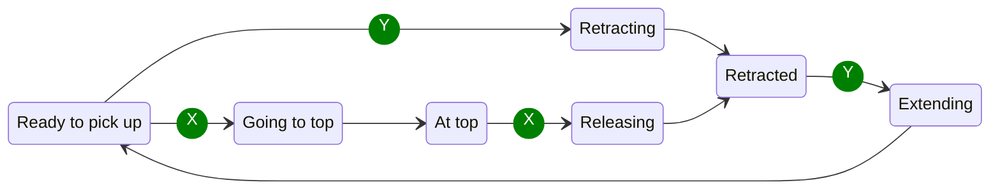
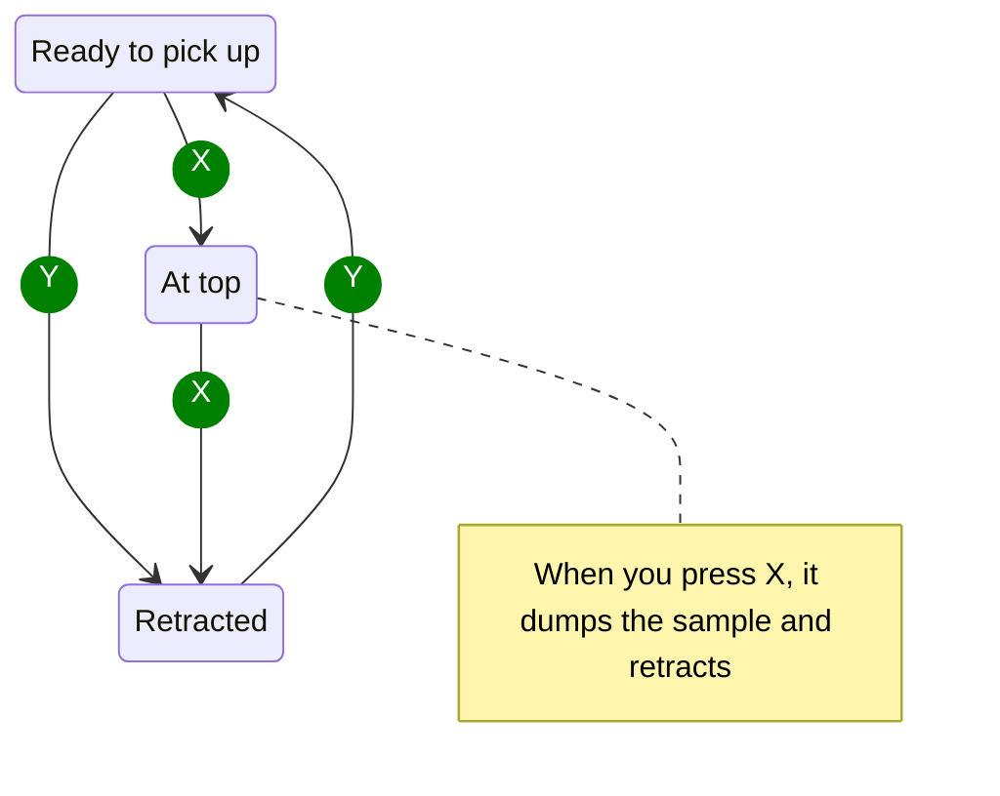

# Information

## Robot Claw States

## Simplified Claw States for Drivers

## Controls

### Gamepad 1

|     Button     | Action                                                    |
|:--------------:|:----------------------------------------------------------|
|     Start      | Reset heading for field centric                           |
|       A        | Switch between tank and field centric                     |
|       B        | Nothing                                                   |
|       X        | Grab sample and raise to basket, or release sample at top |
|       Y        | Extend or retract claw at bottom                          |
| Left Joystick  | Move robot                                                |
| Right Joystick | Rotate robot                                              |
|  Left Trigger  | Nothing                                                   |
| Right Trigger  | Nothing                                                   |
|  Right Bumper  | Nothing                                                   |
|  Left Trigger  | Nothing                                                   |

### Gamepad 2

No controls
